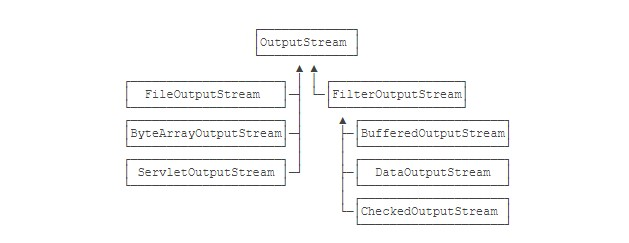

#装饰器模式
##装饰器模式分为两种：
###1、在原有的功能上进行装饰曾强 2、提供新的功能进行装饰

##java的io流设计是典型的装饰器模式
    ####        BufferedInputStream bufferedInputStream = new BufferedInputStream(new FileInputStream("test.xml"));
    ####        new DataInputStream(new CheckedInputStream(new BufferedInputStream(new FileInputStream("xx")), new CRC32()));
    ####        //DataInputStream、 BufferedOutputStream 、CheckedInputStream 都是装饰器类
    ####        //FilterInputStream是装饰器的父类，内部有 目标类InputStream。装饰器类通过继承FilterInputStream
    ####        //就具有了目标类InputStream属性， 从而可以进行装饰增强。
    ####        //源码解读：BufferedOutputStream并没有增加 InputStream 没有的方法，所以使用的是全透明模式
    ####        //而DataInputStream 增加了readLong等方法，属于半透明模式

 
 
